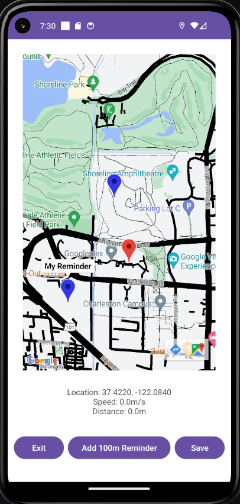

# Android Google Maps App

An android app that can be used to set location-based reminders and view previous routes. Developed using Java, in Andriod Studio.

Transfer the APK to your physical Android device or drag it onto a running virtual device in Android Studio to install it.

Enable location and notification permissions for the app to function correctly.
